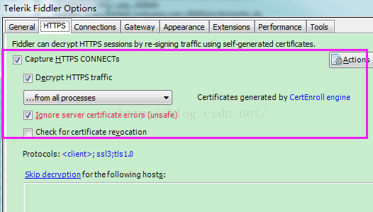
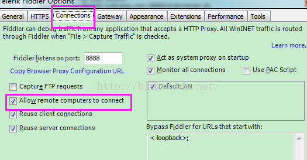
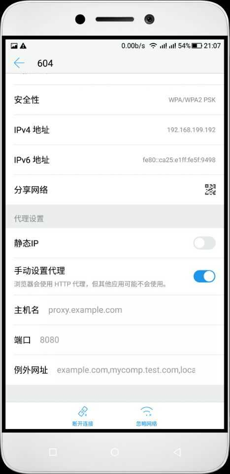

一.对PC（笔记本）参数进行配置

   1. 配置fiddler允许监听到https（fiddler默认只抓取http格式的）

         打开Fiddler菜单项Tools->TelerikFiddler Options->HTTPS，

         勾选CaptureHTTPS CONNECTs,点击Actions，

         勾选Decrypt HTTPS traffic和Ignore servercertificate errors两项,点击OK（首次点击会弹出是否信任fiddler证书和安全提示，直接点击yes就行），见图：
         
            

------

    2.配置fiddler允许远程连接  

         上一步窗口中点击Tools->TelerikFiddler Options->Connections，勾选allow remote computers to connect，默认监听端口为8888（下图Fiddler listens on port就是端口号），若端口被占用可以设置成其他的，配置好后要重新启动fiddler，如下图：  

二.对手机端进行参数配置（安卓为例）

         首先要保证手机和电脑都处于同一个网络；

         然后要知道电脑的ip地址（当然这个电脑是安装fiddler的电脑），电脑ip地址可通过cmd，输入ipconfig查询，或网络共享中ipv4找到。或者鼠标放到fiddler的online上显示出IP地址。我的是192.168.1.108，

         再者要知道fiddler的端口号，Tools->TelerikFiddler Options->Connections，port中值就是端口号，一般默认为8888；接下来开始操作手机；

     

点开浏览器会提示安装证书，一路确认就ok了。
如果没有，就在浏览器输入  192.168.1.108：8888，然后按照提示安装证书。

