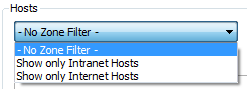

# Fiddler的详细介绍
## 一、Fiddler与其他抓包工具的区别
1. Firebug虽然可以抓包，但是对于分析http请求的详细信息，不够强大。模拟http请求的功能也不够，且firebug常常是需要“无刷新修改”，如果刷新了页面，所有的修改都不会保存； 

2. Wireshark是通用的抓包工具，能获取HTTP，也能获取HTTPS，但是不能解密HTTPS，所以wireshark看不懂HTTPS中的内容，但如果是TCP、UDP协议可以用wireshark. 

3. Httpwatch也是比较常用的http抓包工具，但是只支持IE和firefox浏览器（其他浏览器可能会有相应的插件）；
而Fiddler 是一个使用本地 127.0.0.1:8888 的 HTTP 代理，任何能够设置 HTTP 代理为 127.0.0.1:8888 的浏览器和应用程序都可以使用 Fiddler。 

## 二、Fiddler的工作原理
　  Fiddler是位于客户端和服务器端的HTTP代理，也是目前最常用的http抓包工具之一 。 它能够记录客户端和服务器之间的所有 HTTP请求，可以针对特定的HTTP请求，分析请求数据、设置断点、调试web应用、修改请求的数据，甚至可以修改服务器返回的数据。 

　  既然是代理，也就是说：客户端的所有请求都要先经过Fiddler，然后转发到相应的服务器，反之，服务器端的所有响应，也都会先经过Fiddler然后发送到客户端，所以web客户端和服务器的请求如图1所示：

　  注：使用Fiddler的话，需要先设置浏览器的代理地址，才可以抓取到浏览器的数据包。而很方便的是在你启动该工具后，它就已经自动帮你设置好了浏览器的代理了，当关闭后，它又将浏览器代理还原了。当然如果发现没有自动设置浏览器代理的话，那就得自己动手去浏览器进行设置代理操作了。（可自行百度每个浏览器是如何设置代理的），反正一定要设置相应的代理，否则fiddler是无法捕获到HTTP请求的。
## 三、Fiddler的使用界面介绍
 1、主界面如图2所示：

图2（fiddler主界面）

2、左边web session面板的字段及图标含义如下：
名称 |含义
--|--
<prev>#<prev> | 抓取HTTP Request的顺序，从1开始，以此递增
Result | HTTP状态码
Protocol | 请求使用的协议，如HTTP/HTTPS/FTP等
Host | 请求地址的主机名
URL | 请求资源的位置
Body | 该请求的大小
Caching | 请求的缓存过期时间或者缓存控制值
Content-Type | 请求响应的类型
Process | 发送此请求的进程：进程ID
Comments | 允许用户为此回话添加备注
Custom | 允许用户设置自定义值  

图标 | 含义
--|--
 | 请求已经发往服务器
  | 已从服务器下载响应结果
  | 请求从断点处暂停
  | 响应从断点处暂停
  | 请求使用 HTTP 的 HEAD 方法，即响应没有内容（Body）
  | 请求使用 HTTP 的 POST 方法
  | 请求使用 HTTP 的 CONNECT 方法，使用 HTTPS 协议建立连接隧道
  | 响应是 HTML 格式
  | 响应是一张图片
  | 响应是脚本格式
  | 响应是 CSS 格式
  | 响应是 XML 格式
  | 响应是 JSON 格式
  | 响应是一个音频文件
  | 响应是一个视频文件
  | 响应是一个 SilverLight
  | 响应是一个 FLASH
  | 响应是一个字体
  | 普通响应成功
  | 响应是 HTTP/300、301、302、303 或 307 重定向
  | 响应是 HTTP/304（无变更）：使用缓存文件
  | 响应需要客户端证书验证
  | 服务端错误
  | 会话被客户端、Fiddler 或者服务端终止

3、右边是详情和数据统计面板
1）Statistics关于HTTP请求的性能（例如发送/接受字节数，发送/接收时间，还有粗略统计世界各地访问该服务器所花费的时间）以及数据分析。如图3所示：

2）Inspectors是用于查看会话的内容，上半部分是请求的内容，下半部分是响应的内容，提供headers、textview、hexview,Raw等多种方式查看单条http请求的请求报文的信息，如图4所示：

3）AutoResponder 可用于拦截某一请求，即按自己添加的指定规则重定向到本地的资源或Fiddler资源，从而代替服务器响应。
举例：将“baidu”这个关键字跟本地电脑的一张图片绑定了，再访问带有“baidu”关键字的地址，就会被劫持，具体步骤如图5所示： 

启用规则后（勾选enable rules），在浏览器输入pan.baidu.com，会发现被劫持了，显示的是绑定的本地图片，而不是pan.baidu.com的页面

图6（被劫持）

4）Composer 自定义请求发送服务器，Parsed模式下你只需要提供简单的URLS地址即可，如图7所示

图7（Composer选项卡）

5）Filters 即过滤规则，通过设置过滤规则来过滤所需的http请求，如图8所示，勾选左上角的Use Filters开启过滤器：

图8（Filters选项卡）

　　而这里有两个最常用的过滤条件：Zone和Host
a.Zone 指定只显示内网（Intranet）或互联网（Internet）的内容，如图9所示：

图9

b.Host 指定显示某个域名下的会话，如图10所示，如果框框为黄色，表示修改未生效，点击红圈里的文字即可：

图10

6）timeline 请求响应时间，在左侧会话窗口点击一个或多个请求，Timeline 便会显示指定内容从服务端传输到客户端的时间，如图11所示：

图11（timeline选项卡）

## 四、Fiddler的其他功能介绍

1. Fiddler 设置解密HTTPS的网络数据
　Fiddler可以通过伪造CA证书来欺骗浏览器和服务器。大概原理就是在浏览器面前Fiddler伪装成一个HTTPS服务器，而在真正的HTTPS服务器面前Fiddler又装成浏览器，从而实现解密HTTPS数据包的目的。
解密HTTPS需要手动开启，依次点击：Tools –> Fiddler Options –>  HTTPS ->勾选Decrypt HTTPS traffic -> 点击Yes，在弹出的对话框中选择是即可，如图12所示

图12

2. Fiddler 内置命令与断点
　FIddler断点功能就是将请求截获下来，直接点击Fiddler下图的图标位置，就可以设置全部请求的断点，也可以在命令栏输入断点命令进行截获，如图13所示

图13（断点）

　　而断点的命令则可以精确设置需要截获那些请求，如下表所示：  

命令 | 对应请求项 | 介绍 | 示例
--|--|--|-- 
? | All |  问号后边跟一个字符串，可以匹配出包含这个字符串的请求 | ?google
<prev>></prev> |  Body | 大于号后面跟一个数字，可以匹配出请求大小，大于这个数字请求 | >1000
< | Body |  小于号跟大于号相反，匹配出请求大小，小于这个数字的请求 | <100
= | Result | 等于号后面跟数字，可以匹配HTTP返回码 | =200
@ | Host |  @后面跟Host，可以匹配域名 |@www.baidu.com
select | Content-Type|  select后面跟响应类型，可以匹配到相关的类型 | select image
cls | All | 清空当前所有请求 | cls
dump | All | 将所有请求打包成saz压缩包，保存到“我的文档\Fiddler2\Captures”目录下 | dump
start | All | 开始监听请求 | start
stop | All | 停止监听请求 | stop
断点命令   |  
bpafter | All | bpafter后边跟一个字符串，表示中断所有包含该字符串的请求 | bpafter baidu（输入bpafter解除断点）
bpu  | All | 跟bpafter差不多，只不过这个是收到请求了，中断响应 |  bpu baidu（输入bpu解除断点）
bps | Result | 后面跟状态吗，表示中断所有是这个状态码的请求 | bps 200（输入bps解除断点）
bpv / bpm | HTTP方法 | 只中断HTTP方法的命令，HTTP方法如POST、GET | bpv get（输入bpv解除断点）
g  / GO | All | 放行所有中断下来的请求 | g 

 *注：
    * 1、如bpafter断点命令使用方法为：bpafter 后边跟字符串->表示中断所有包含该字符串的请求；   bpafter ->表示解除刚刚的中断断点；
　　 * 2、该表来源于博客：http://blog.csdn.net/qq_21445563/article/details/51017605*

3. 中断会话后修改表单内容
　　不知道什么原因捕获不了登录界面的会话（除了博客园网站外，其他很多网站的会话都捕获不到->解决方法：按上面‘Fiddler 设置解密HTTPS的网络数据’所写的步骤设置一下），所以下面的实例是来自小坦克的，详细博客地址在图片正文贴着。
　　看个实例，模拟博客园的登录， 在IE中打开博客园的登录页面，输入错误的用户名和密码，用Fiddler中断会话，修改成正确的用户名密码。这样就能成功登录：
 
　　1. 用IE 打开博客园的登录界面  http://passport.cnblogs.com/login.aspx
　　2. 打开Fiddler,  在命令行中输入bpu http://passport.cnblogs.com/login.aspx
　　3. 输入错误的用户名和密码，点击登录
　　4. Fiddler 能中断这次会话，选择被中断的会话，点击Inspectors tab下的WebForms tab 修改用户名密码，然后点击Run to Completion 如图14所示。
　　5. 结果是正确地登录了博客园（当然Fiddler中也能修改Response）

图14（该实例来源于博客：http://kb.cnblogs.com/page/130367/）

4. Fiddler中会话比较功能
　选中2个会话，右键然后点击Compare，就可以用WinDiff来比较两个会话的不同了（注：需要安装WinDiff，自行百度安装就可以了，这里就不细说安装步骤），如图15所示

图15（compare功能）

5. Fiddler中提供的编码工具
　　点击Fiddler 工具栏上的TextWizard,  这个工具可以Encode和Decode string，如图16所示

图16（TextWizard界面）

6. Fiddler中的查询会话
　　Edit->Find Sessions（或Ctrl+F）打开Find Sessions的对话框，输入关键字查询你要的会话。 查询到的会话会用黄色显示，如图17所示

图17（find session界面）

7. Fiddler中的保存会话
　　有些时候我们需要把会话保存下来，以便发给别人或者以后去分析。  保存会话的步骤如下：File->Save->Selected Sessions

8. Fiddler中的script系统
　　首先先安装SyntaxView插件，Inspectors tab->Get SyntaxView tab->Download and Install SyntaxView Now... 如图18所示

图18（安装SyntaxView插件）

　　安装成功后Fiddler 就会多了一个Fiddler Script tab，如图19所示：

图19

　　在里面我们就可以编写脚本了， 看个实例让所有cnblogs的会话都显示红色。
　　把这段脚本放在OnBeforeRequest(oSession: Session) 方法下，并且点击"Save script"
　　（该段脚本来源于博客：http://kb.cnblogs.com/page/130367/）
if (oSession.HostnameIs("www.cnblogs.com")) {
　　oSession["ui-color"] = "red";
}
　　这样所有的cnblogs的会话都会显示红色。

9. 如何在VS调试网站的时候使用Fiddler
　　我们在用visual stuido 开发ASP.NET网站的时候也需要用Fiddler来分析HTTP， 默认的时候Fiddler是不能嗅探到localhost的网站。不过只要在localhost后面加个点号，Fiddler就能嗅探到。
　　例如：原本ASP.NET的地址是 http://localhost:9999/Default.aspx，  加个点号后，变成 http://localhost.:9999/Default.aspx 就可以了
